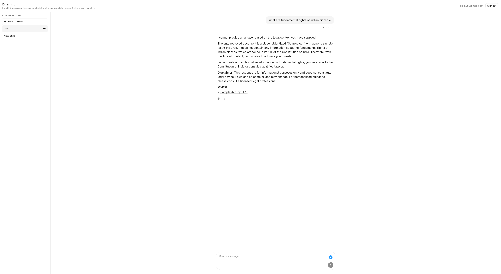

# Dharmiq

Open-source Indian legal information assistant for citizens. Dharmiq explains rights and obligations in plain language, grounded in statutory documents (IndiaCode corpus), with citations and clear disclaimers that it does not provide legal advice.



## Features

- **RAG chat** – multi-agent pipeline (clarify, retrieve, answer, validate) over indexed legal PDFs
- **User uploads** – private PDF/image indexing for contract and notice questions
- **Citations** – answers link back to source documents in the UI
- **Corpus ingestion** – daily scan, parse, chunk, embed pipeline for IndiaCode PDFs
- **Evaluation** – Ragas + LLM-judge scoring on curated Q&A datasets
- **Observability** – Prometheus metrics and Grafana dashboards

MVP scope covers fundamental rights, consumer issues, and employment (see [`docs/prd.md`](docs/prd.md)).

## Repository layout

```text
dharmiq/
  backend/          # FastAPI app, Celery workers, RAG pipeline
  frontend/         # React + assistant-ui chat client
  config/           # Environment YAML (dev, beta) + Grafana/Prometheus
  docs/             # PRD, TRD, implementation plan
  data/             # Local corpus, uploads, eval data (gitignored)
  docker-compose.yml
```

| Path | Description |
|------|-------------|
| [`backend/README.md`](backend/README.md) | API setup, endpoints, ingestion, eval, metrics |
| [`frontend/README.md`](frontend/README.md) | Vite dev server and build |
| [`docs/prd.md`](docs/prd.md) | Product requirements |
| [`docs/trd.md`](docs/trd.md) | Technical design |
| [`docs/plan.md`](docs/plan.md) | Implementation milestones |

## Prerequisites

- [Docker](https://docs.docker.com/) – Postgres, Redis, Prometheus, Grafana
- [uv](https://docs.astral.sh/uv/) – Python backend
- [nvm](https://github.com/nvm-sh/nvm) – Node.js (see `.nvmrc`)
- [OpenRouter](https://openrouter.ai/) API key – chat and eval LLM calls

## Quick start

### 1. Infrastructure

```bash
cp .env.example .env
# Set OPENROUTER_API_KEY in .env

docker compose up -d
```

### 2. Backend

```bash
cd backend
uv sync --dev
uv run alembic upgrade head
mkdir -p ../data/corpus/india_code/raw ../data/eval/datasets ../data/eval/runs

uv run dharmiq-api
```

In another terminal (from `backend/`):

```bash
uv run celery -A celery_app worker --loglevel=info
```

### 3. Frontend

```bash
nvm install && nvm use
cd frontend
npm install
npm run dev
```

Open http://localhost:5173. The frontend proxies `/api` to the backend on port 8000.

### 4. Optional – observability

```bash
docker compose up -d prometheus grafana
```

| Service | URL |
|---------|-----|
| App | http://localhost:5173 |
| API | http://localhost:8000 |
| API health | http://localhost:8000/api/health |
| Metrics | http://localhost:8000/metrics |
| Prometheus | http://localhost:9090 |
| Grafana | http://localhost:3000 (admin / admin) |

In Grafana: **Dashboards → Dharmiq → Dharmiq Overview**. The API must be running for Prometheus to scrape metrics.

## Configuration

Non-secret settings live in `config/config.dev.yaml` (local) and `config/config.beta.yaml` (deployment). Secrets go in `.env`:

| Variable | Description |
|----------|-------------|
| `DHARMIQ_ENV` | Config profile (`dev`, `beta`) |
| `DHARMIQ_DATABASE_PASSWORD` | Postgres password (default: `dharmiq`) |
| `DHARMIQ_JWT_SECRET` | JWT signing secret |
| `OPENROUTER_API_KEY` | Required for chat and eval |

Local Postgres is exposed on **port 5433** via Docker Compose.

## Data & ingestion

Legal PDFs go under `data/corpus/india_code/raw/`. After adding files:

```bash
cd backend
uv run celery -A celery_app call dharmiq.ingestion.sync_india_code_pdfs
```

User uploads are stored under `data/uploads/{user_id}/`. The `data/` directory is gitignored.

## Evaluation

See [`backend/dharmiq/eval/dataset_format.md`](backend/dharmiq/eval/dataset_format.md). Requires an indexed corpus:

```bash
cd backend
uv run dharmiq-eval --dataset v1_fundamental_rights
```

## Development

```bash
# Backend tests
cd backend && uv run pytest -m "not slow"

# Backend lint
cd backend && uv run ruff check .

# Frontend lint
cd frontend && npm run lint
```

## Architecture (high level)

```text
┌─────────────┐     REST/JWT      ┌──────────────────────────────────┐
│  Frontend   │ ────────────────► │  FastAPI (chat, auth, uploads)   │
│  (React)    │                   │  LangChain agents + pgvector RAG │
└─────────────┘                   └───────────────┬──────────────────┘
                                                  │
                    ┌─────────────────────────────┼─────────────────────┐
                    ▼                             ▼                     ▼
              PostgreSQL                      Redis                 OpenRouter
           (+ pgvector)                    (Celery broker)            (LLM API)
                    ▲
                    │ Celery workers: ingestion, eval
                    └────────────────────────────────────────────────────
```

## Disclaimer

Dharmiq provides general legal **information**, not legal advice. Users should consult a qualified lawyer for decisions that matter to them.

## License

See repository license file when published.
