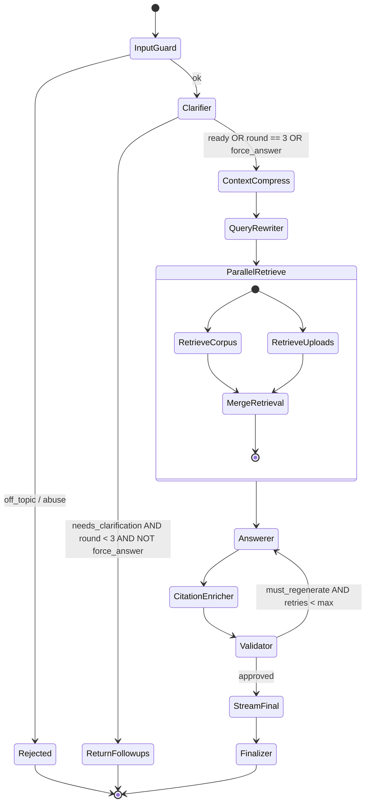

# Dharmiq v0.2 — Agentic Architecture PRD & TRD

**Status:** Draft (post Round 1 + Round 2 clarification)  
**Version target:** 0.2  
**Baseline:** v0.1 (linear clarifier → rewriter → retrieval → answerer → validator pipeline, synchronous REST, no streaming)

---

## Clarification summary (Round 1)

| Topic | Decision |
|-------|----------|
| v0.2 scope | Agent architecture, Perplexity-like progress UI, streaming, citations/validation — **same legal domains as v0.1** |
| Latency | **No hard cap** — async jobs acceptable for heavy queries |
| Deployment | **Single VPS** modular monolith (API + Celery on same host) |
| Progress UI | **Configurable** — friendly default steps + expandable detail panel |
| Citations | **Tiered** — strict for statutory claims; relaxed for procedural guidance |
| Uploads | **User library + per-chat attachment** selection |
| Caching | **Minimal in v0.2** — architecture hooks only; aggressive caching deferred |
| Guardrails | **Basic** — rate limits, length caps, prompt-injection heuristics, off-topic rejection |
| Framework | **Compare and recommend** in this doc |
| LLM budget | **$5–20 / active user / month** — quality-first routing |

## Clarification summary (Round 2)

| Topic | Decision |
|-------|----------|
| LLM / provider | **LiteLLM SDK** as unified `LLMProvider` — chat, embed, rerank via one interface; swap model/provider in config |
| Reranker | **Pluggable** — local cross-encoder **default**; optional API rerank (Cohere/Together via LiteLLM) in config |
| Progress views | **3 tiers** — concise (default), detailed (user opt-in), debug (admin/dev only) |
| Upload attach | **Explicit attach only** — uploads go to library first; user must attach to a chat before retrieval uses them |

## Clarification summary (Round 3 — tradeoffs)

| Tradeoff | Decision |
|----------|----------|
| Latency vs correctness | **Correctness first** — extra validator passes, reranking, clarifiers OK even at 2–5 min |
| Citation density | **Heavy** — cite most factual sentences; target 8–15 citations per answer |
| Quoting | **Quote statutory + user-contract language** when defining rights, duties, penalties |
| Clarifier | **Ask freely** — up to 3 rounds of follow-ups before answering |
| Answer depth | **Comprehensive** — structured sections, scenarios, grounded claims |
| Validator on failure | **Block release** — do not stream if unsupported statutory claims remain |
| Weak retrieval | **Refuse** — explain insufficient sources; suggest rephrase or upload |
| Orchestration | **LangGraph custom graph** (not DeepAgents harness) |
| LLM abstraction | **LiteLLM SDK** |

## Clarification summary (Round 4 — implementation hardening)

These are **binding implementation decisions** added so AI agents can build v0.2 without further input. Where a section below conflicts with this table, **this table wins**.

| # | Topic | Decision |
|---|-------|----------|
| R4-1 | Models | **All DeepSeek V4.** `fast` = `openrouter/deepseek/deepseek-v4-flash`; `primary`/answerer = `openrouter/deepseek/deepseek-v4-pro`; `validator` = `openrouter/deepseek/deepseek-v4-pro` with **thinking/reasoning enabled** (stronger tier). Do **not** use `deepseek-chat`/`deepseek-reasoner` — deprecated 2026-07-24. |
| R4-2 | Embeddings | **Fixed at local 384-dim MiniLM for v0.2.** Embedding model is **NOT** swappable by config — changing it requires a vector-column dimension change + full corpus/upload re-embed. LiteLLM wraps **chat always** and **remote** embed/rerank only; local embed/rerank stay on existing Dharmiq backends behind the internal interface. |
| R4-3 | Clarifier rounds | **END-and-return** model: each clarification round is a **new POST message / new `chat_request`**. The round counter persists in `chat_requests.clarifier_round` (seeded from prior request in the same session/topic). No in-graph human-in-the-loop interrupt. "Answer with what you have" sets `force_answer=true` on the next POST. |
| R4-4 | Streaming | **Replay, not regenerate.** The answerer produces the full draft (non-streamed); the validator approves that exact string; `finalizer` **replays the validated string as a simulated SSE token stream**. There is **no second LLM call** for streaming. |
| R4-5 | `metadata` column | SQLAlchemy reserves the attribute name `metadata`. Map a JSONB column named `metadata` to a **different attribute**: `chunk_metadata: Mapped[dict] = mapped_column("metadata", JSONB, server_default="{}")`. Never declare a model attribute literally named `metadata`. |
| R4-6 | `search_vector` | Postgres **GENERATED STORED** column: `search_vector tsvector GENERATED ALWAYS AS (to_tsvector('english', coalesce(text,''))) STORED`, with a GIN index. No application-side trigger. |
| R4-7 | Progress event `seq` | Assigned by **atomic counter** `redis.incr("chat:req:{id}:seq")` (not `SELECT max(seq)+1`) to avoid races between parallel nodes. Unique `(chat_request_id, seq)` still enforced as a backstop. |
| R4-8 | Quote matching | Quote validation uses **normalized fuzzy matching**, not raw substring equality: collapse whitespace, NFKC-normalize unicode (incl. `§`, smart quotes), case-insensitive, accept ≥ 0.95 span similarity. Prevents regeneration storms. |
| R4-9 | Debug gating | Use `user.is_superuser` **only** (no `role` field exists). Debug also requires `DHARMIQ_DEBUG_PROGRESS=true`. The SSE **replay path** (`?after_seq=N`) MUST apply the same visibility filtering as the live stream. |
| R4-10 | Dependency pinning | Pin exact (or `~=` compatible-release) versions for `langgraph`, `langgraph-checkpoint-postgres`, `litellm`. No bare `>=` floors for these fast-moving libs. Validate mutual compatibility in P0/P2. |
| R4-11 | Eval gating | Split CI into (a) **deterministic master smoke** (mocked LLM, the only hard CI gate) and (b) **eval gate** (manual/nightly, needs corpus + `OPENROUTER_API_KEY`). Commit a small eval dataset under `data/eval/datasets/` (un-ignore that path). Record the measured v0.1 baseline before asserting `≥ 0.85`. |
| R4-12 | New chat API route | The session-scoped `POST /api/chat/sessions/{id}/messages` and `GET /api/chat/requests/{id}/stream` routes are **new** (v0.1 has only `POST /api/chat`). Creating them and migrating the frontend `sendChatMessage` are explicit tasks (P3 + P10). |

---

# Part A — Product Requirements (PRD)

## A1. Vision for v0.2

v0.2 transforms Dharmiq from a synchronous “black box” chat API into a **production-grade agentic legal information system** where users can:

1. See **live progress** as specialized agents work (Perplexity-like), in **concise / detailed / debug** views.
2. Receive **streamed final answers** rich with **inline citations and verbatim quotes** from statutes and attached user documents — the primary differentiator from general-purpose chat.
3. Trust answers that pass a **multi-layer validation gate** (correctness over latency; **block** release if statutory claims are unsupported).
4. Attach **library documents** to specific chats and cite from corpus + uploads with **heavy citation density**.
5. Be **asked clarifying questions freely** (up to 3 rounds) so answers are precise, not guessed.
6. Run **long conversations and large documents** without context blow-up (compression tiers).

**Product positioning:** Dharmiq is not a chatbot — it is a **grounded legal information system**. Every design choice (prompts, validator, citation enricher, refusal on weak retrieval) optimizes for **trust, traceability, and source fidelity** over fluency or speed.

Out of scope for v0.2: new legal domains, state acts expansion, Hindi UI, case law, monetization, aggressive semantic caching.

## A2. User stories (new / upgraded)

### US-1 — Transparent agent progress (3 view tiers)

**As** Anita, **when** I submit a legal question, **I want** to see steps like “Understanding your question…”, “Searching laws…”, “Checking answer…”, **so that** I know the system is working and not stuck.

**Acceptance criteria**

- **Concise (default):** 4–6 user-friendly step labels; no agent names, no chunk text.
- **Detailed (user opt-in):** agent names, retrieval counts, validator verdict summary, truncated chunk titles (section + Act name, ~120 chars preview).
- **Debug (admin/dev only):** full chunk snippets, query rewrites, rerank scores, token breakdown, validator issues JSON — gated by `is_superuser` or `DHARMIQ_DEBUG_PROGRESS=true` + admin role.
- View preference persisted in localStorage; debug never shown to regular users in production.
- Steps update in real time via SSE (or reconnect-safe polling fallback).
- Failed steps show a recoverable error with retry.

### US-1b — Clarifying questions encouraged

**As** the system, **when** user input is ambiguous, **I should** ask follow-up questions freely (employment type, dates, attached docs, jurisdiction cues) **before** retrieving and answering.

**Acceptance criteria**

- Up to **3 rounds** of clarifier follow-ups per topic thread.
- Clarifier explains *why* each question helps (“This affects which Act applies”).
- After round 3, proceed with explicit **stated assumptions** listed in the answer preamble.
- User can skip clarifications via “Answer with what you have” action (logs assumption risk).

### US-2 — Streamed answer with citations and quotes (differentiator)

**As** Sanjay, **when** the final answer is ready, **I want** text to appear token-by-token with clickable citations and quoted source language, **so that** I can verify claims myself — unlike a generic LLM chat.

**Acceptance criteria**

- Final assistant message streams via SSE **only after validation passes** (not raw draft).
- **Heavy citation density:** target 8–15 inline markers per comprehensive answer; most factual sentences cite a source.
- Citations render as `[1]`, `[2]` linking to document viewer with page/section highlight and quote highlight when applicable.
- **Verbatim block quotes** for statutory and user-contract language when defining rights, duties, penalties, notice periods, or termination conditions.
- Separate visual styling for **“Law says”** vs **“Your document says”** citation groups.
- Disclaimer appended once at end of stream.
- If validator cannot certify statutory claims → **no stream**; user sees refusal message with suggested next steps.

### US-3 — Long-running async query

**As** Ravi with a complex contract + statute question, **I want** to submit and wait (or navigate away) while agents work, **so that** correctness is not sacrificed for speed.

**Acceptance criteria**

- Request returns immediately with `chat_request_id`.
- Client subscribes to progress + answer streams.
- On completion, full message persisted; refresh restores state.
- Optional email notification deferred to v0.3 (hook only in v0.2).

### US-4 — Document library + chat attachment

**As** Ravi, **I want** uploads in a personal library and to pick which files apply to this chat, **so that** retrieval stays focused.

**Acceptance criteria**

- Upload once → appears in library with processing status.
- Chat session stores `attached_upload_ids[]`.
- Uploads land in the user library after processing; **not** auto-attached to the current chat.
- User explicitly attaches documents via attachment picker or `POST .../attachments`.
- Retrieval searches corpus always; user uploads **only** when explicitly attached to that session.
- Answers distinguish “your document says” vs “the law says”.

### US-5 — Misuse protection

**As** the platform, **I want** basic input validation, **so that** API costs and abuse are bounded.

**Acceptance criteria**

- Per-user rate limits (requests/minute, tokens/day soft cap).
- Max message length (e.g. 8 KB).
- Off-topic / non-legal requests politely refused.
- Obvious prompt-injection patterns flagged before agent pipeline runs.

## A3. Citation-first design policy

Dharmiq’s core differentiator is **grounded, quotable, verifiable answers**. Prompts, validator rules, and UI are designed together — not bolted on post-hoc.

### A3.1 Citation density (Round 3: heavy)

| Claim type | Requirement | Quote behavior |
|------------|-------------|----------------|
| Statutory / regulatory | **Every** rights/obligations claim must cite `source_document` + section; validator **blocks** unsupported claims | **Verbatim block quote** when defining rights, duties, penalties, or ambiguous language |
| User upload interpretation | **Every** interpretation cites upload chunk + page; label **“Your document states”** | **Quote clause text** for termination, notice, non-compete, liability clauses |
| Procedural guidance | Cite governing Act/Rule where step derives from law | Paraphrase OK with section pointer |
| General legal information | Cite primary Act; cross-reference Rules if applicable | Quote optional |

**Prompt contract (answerer):** System prompt mandates `> blockquote` for quoted statutory/clause language, inline `[n]` markers on every factual sentence, and a closing **Sources** section duplicating citation metadata.

**Prompt contract (validator):** Reject answers where: (a) statutory claim lacks citation, (b) quote text does not **normalized-fuzzy-match** the chunk (R4-8: collapse whitespace, NFKC-normalize `§`/smart quotes, case-insensitive, ≥ 0.95 span similarity — **not** raw substring equality), (c) upload interpretation lacks “your document” attribution.

### A3.2 Refusal on weak retrieval (Round 3: refuse)

If merged retrieval returns fewer than 2 chunks above relevance threshold **or** top rerank score < configurable floor:

- Do **not** invoke answerer with empty context.
- Return structured refusal: “I could not find sufficient sources in [corpus / your attached documents] to answer reliably.”
- Suggest: rephrase, attach relevant document, or narrow question.
- Clarifier may offer one more narrowing question before retry.

### A3.3 Answer structure (comprehensive)

Default answer template:

1. **Summary** (2–3 sentences, cited)
2. **What the law says** (quoted sections, cited)
3. **What your document says** (if uploads attached, quoted clauses)
4. **How this applies to your situation** (scenario analysis, cited)
5. **Practical next steps** (procedural; soft citation)
6. **Assumptions** (if clarifier rounds exhausted)
7. **Disclaimer**

## A4. Non-goals (v0.2)

- Corpus expansion beyond current IndiaCode subset.
- Hindi or multilingual answers.
- Case law ingestion.
- Full content moderation suite.
- Semantic answer cache at scale.
- Horizontal scale-out / K8s.
- Email/push notifications (interface only).

## A5. Success metrics

| Metric | Target |
|--------|--------|
| Faithfulness (Ragas) on eval set | ≥ 0.85 (up from v0.1 baseline) |
| Citation precision (manual sample) | ≥ 95% for statutory claims |
| Answers with ≥1 block quote (statutory Qs) | ≥ 80% |
| Refusal rate on weak retrieval | tracked; false-refusal < 10% on eval |
| p50 time-to-first-progress-event | < 2 s |
| p50 time-to-first-answer-token (after validation) | < 45 s for typical query |
| Validator regeneration rate | < 30% of requests |
| Upload parse success rate | ≥ 95% for PDF; ≥ 85% for scanned images |

---

# Part B — Technical Requirements (TRD)

## B1. Architecture overview

```text
┌─────────────────────────────────────────────────────────────────────────┐
│  Frontend (React + assistant-ui)                                        │
│  - Progress stepper: concise | detailed | debug (admin)                 │
│  - SSE client: progress events + answer token stream                    │
│  - Upload library + chat attachment picker                              │
└───────────────────────────────┬─────────────────────────────────────────┘
                                │ REST + SSE
┌───────────────────────────────▼─────────────────────────────────────────┐
│  FastAPI                                                                 │
│  - POST /chat/sessions/{id}/messages  → enqueue or inline (dev)         │
│  - GET  /chat/requests/{id}/stream    → SSE multiplexed channel         │
│  - Input guardrail middleware                                           │
└───────────────────────────────┬─────────────────────────────────────────┘
                                │
        ┌───────────────────────┼───────────────────────┐
        ▼                       ▼                       ▼
┌───────────────┐     ┌─────────────────┐     ┌─────────────────┐
│ Celery worker │     │ LangGraph       │     │ PostgreSQL      │
│ (chat jobs)   │────►│ Agent graph     │────►│ + pgvector      │
│               │     │ + checkpoints   │     │ + tsvector      │
└───────────────┘     └────────┬────────┘     │ + dual-tier     │
                               │              │   text storage  │
                               ▼              └─────────────────┘
                        LiteLLM SDK (chat / embed / rerank — provider-agnostic)
```

**Design principles**

1. **Orchestration** in LangGraph; **retrieval/ingestion** stay Dharmiq-native Python.
2. **Immutable agent artifacts** per step — concurrent agents write to separate keys; merge node resolves conflicts.
3. **Stream only validated output** — draft answer never streamed to user.
4. **Dual-tier text** everywhere context enters an LLM.
5. **Provider-agnostic LLM access** — agents use **LiteLLM SDK** for chat, embeddings, and optional API rerank; swap model/provider via config only.
6. **Citation-first outputs** — prompts and validator enforce heavy citing and quoting before any answer streams.

---

## B2. Orchestration framework comparison & recommendation

### B2.1 Orchestration & runtime candidates

| Framework | Strengths for Dharmiq | Weaknesses | Fit score |
|-----------|----------------------|------------|-----------|
| **LangGraph** | State machine graphs, parallel nodes, Postgres checkpointing, SSE streaming, precise validator loops | Learning curve; checkpoint tables | **9/10** ✓ Round 3 |
| **DeepAgents** | Batteries-included harness: planning, subagents, context compression middleware, model-agnostic | Opinionated for open-ended autonomous tasks; harder to enforce strict legal citation/validation graph; built on LangGraph anyway | 6/10 |
| **LangChain LCEL only** | Already partially used | No durable graph, awkward parallel branches | 6/10 |
| **CrewAI** | Role-based agents, streaming Flows | Less precise control for validation loops | 5/10 |
| **Custom asyncio** | Full control | Must build checkpointing, streaming, progress from scratch | 6/10 |
| **Temporal** | Best-in-class durable workflows, retries, visibility, long-running jobs | **Extra service** on VPS (Temporal server + DB); steep ops overhead for solo/small team; overkill when LangGraph + Celery + Postgres checkpoints suffice | 4/10 |
| **Pydantic AI** | Excellent structured outputs | Younger graph/checkpoint ecosystem | 5/10 |

### B2.2 LLM gateway & provider abstraction candidates

| Tool | Strengths for Dharmiq | Weaknesses | Fit score |
|------|----------------------|------------|-----------|
| **LiteLLM SDK** | Unified `completion`, `embedding`, **`rerank`** across 100+ providers; OpenAI-compatible; retry/fallback router; same interface for local + cloud rerank | Extra dependency; some provider quirks need testing | **9/10** ✓ Round 3 |
| **LiteLLM Proxy** (self-hosted) | Central gateway, virtual keys, cost tracking, admin UI | Second long-running service on VPS; v0.2 can use SDK-only and add proxy in v0.3 | 7/10 (defer) |
| **Custom LLMProvider + OpenRouter** | Minimal deps; current v0.1 code | Must maintain adapters for embed/rerank separately | 6/10 |
| **OpenRouter only** | Simple | No native rerank; vendor lock-in | 5/10 |

### B2.3 DeepAgents vs LangGraph vs Temporal (detailed)

**DeepAgents** (LangChain’s “agent harness” on LangGraph)

- Bundles: planning tool (`write_todos`), virtual filesystem, subagent spawning, context compression middleware.
- Best for: long-horizon autonomous research/coding agents with tool loops.
- **Why not primary for Dharmiq:** Our pipeline is a **deterministic legal DAG** (clarify → retrieve → answer → validate), not an open-ended agent loop. Citation/validator rules need explicit graph edges DeepAgents would fight. We may **borrow** context-compression middleware patterns in v0.2.1.
- Relationship: DeepAgents ⊂ LangGraph runtime — not an either/or replacement.

**LangGraph (custom graph)** ✓ chosen

- Explicit nodes for clarifier, parallel retrieval, validator loop, stream gate.
- Postgres checkpointing aligns with existing DB.
- Full control over “block stream if validator fails” — critical for Round 3.

**Temporal**

- Durable workflow engine: activities, timers, saga patterns, web UI for workflow history.
- **Why not v0.2:** Requires running Temporal Server + persistence DB alongside Postgres/Redis on a single VPS. LangGraph checkpoints + Celery already cover async chat jobs and crash recovery. Consider Temporal only if we need cross-service sagas (e.g. ingest → notify → bill) at scale.
- **Hybrid note:** Celery remains for ingestion/eval; LangGraph for chat graph — no Temporal needed yet.

### B2.4 Recommendation (updated Round 3)

| Layer | Choice |
|-------|--------|
| Orchestration | **LangGraph custom StateGraph** |
| LLM / embed / rerank | **LiteLLM SDK** (`litellm.completion`, `litellm.embedding`, `litellm.rerank`) |
| Async jobs | **Celery** (chat worker + ingestion) |
| Checkpoints | **langgraph-checkpoint-postgres** |
| DeepAgents | Not adopted; optional middleware patterns later |
| Temporal | Deferred |
| LiteLLM Proxy | Deferred to v0.3 if multi-tenant keys needed |

Keep Dharmiq-native:

- `dharmiq.llm.retrieval` — hybrid pgvector + BM25
- `dharmiq.ingestion.*` — parsers, chunkers
- Agent prompt YAMLs — wrap in LangGraph nodes

### B2.5 LiteLLM integration (replaces custom LLMProvider)

All agent nodes call thin wrappers over **LiteLLM** — never vendor SDKs directly.

LiteLLM wraps **chat (always)** and **remote** embed/rerank. **Local** embeddings (existing `LocalEmbeddingBackend`) and **local** rerank (sentence-transformers `CrossEncoder`) do **not** route through LiteLLM — they sit behind the same internal interface (see R4-2, B11.4).

```python
from litellm import acompletion, arerank

async def chat_complete(model: str, messages: list[dict], **kwargs) -> ModelResponse:
    return await acompletion(model=model, messages=messages, temperature=0, **kwargs)

async def rerank_remote(model: str, query: str, documents: list[str], top_n: int) -> list[int]:
    # arerank follows the Cohere format: results is a list of {"index", "relevance_score"}.
    response = await arerank(model=model, query=query, documents=documents, top_n=top_n)
    return [r["index"] for r in response.results]   # NOT response.results (those are dicts)
```

**Config (provider-agnostic for chat/remote-rerank; embeddings fixed — see R4-2):**

```yaml
llm:
  # LiteLLM model strings for chat roles
  roles:
    primary: openrouter/deepseek/deepseek-v4-pro     # answerer
    fast: openrouter/deepseek/deepseek-v4-flash      # guard/clarifier/rewriter/compressor
    embedding: local   # FIXED 384-dim MiniLM in v0.2; changing requires full reindex (R4-2)

  agents:
    validator:
      model: openrouter/deepseek/deepseek-v4-pro
      reasoning: { enabled: true }   # thinking mode = stronger validation tier (R4-1)

  rerank:
    backend: local              # local (sentence-transformers CrossEncoder) | litellm (remote)
    local_model: BAAI/bge-reranker-base
    litellm_model: cohere/rerank-english-v3.0   # only when backend=litellm
    api_key_env: COHERE_API_KEY
```

OpenRouter remains default via the LiteLLM `openrouter/...` prefix. Switching the **chat** provider (Azure, Anthropic direct, Groq, …) is a config string change. Switching the **embedding** model is **not** — it requires a migration + full re-embed (R4-2).

> **Model availability note (verified 2026-06):** `deepseek-v4-flash` and `deepseek-v4-pro` are current. The legacy `deepseek-chat` / `deepseek-reasoner` aliases are **deprecated 2026-07-24** — do not use them.

**Migration path:** Wrap existing `run_clarifier`, `run_query_rewriter`, etc. as node functions; replace `pipeline.py` linear flow with compiled `StateGraph`. v0.1 pipeline remains fallback behind feature flag `agent_graph_v2=false` until stable.

**New dependencies** (pin exact / compatible-release per R4-10; resolve and lock actual versions in P0/P2)

```toml
langgraph~=0.6.0
langgraph-checkpoint-postgres~=2.0.0
litellm~=1.60          # pin minor; validate arerank + reasoning passthrough
python-docx~=1.1
markdown-it-py~=3.0
# Local rerank (when rerank.backend=local)
sentence-transformers>=3.4.0  # already present; CrossEncoder for rerank
```

> Do not ship bare `>=` floors for `langgraph` / `langgraph-checkpoint-postgres` / `litellm` (R4-10) — they break reproducibility. Lock the resolved versions in `uv.lock` and the risk register.

---

## B3. Agent graph schema

### B3.1 Agents (nodes)

| Node ID | Agent | Model tier | Purpose |
|---------|-------|------------|---------|
| `input_guard` | InputGuard | none / tiny | Rate limit, length, injection heuristics, off-topic |
| `clarifier` | Clarifier | fast | Triage; **up to 3 rounds** of follow-ups; topic classification |
| `context_compressor` | ContextCompressor | fast | Summarize history + attached doc summaries for LLM window |
| `query_rewriter` | QueryRewriter | fast | 2–4 statute-oriented search queries |
| `retrieve_corpus` | CorpusRetriever | none | Hybrid search over `document_chunks` |
| `retrieve_uploads` | UploadRetriever | none | Hybrid search over attached uploads only |
| `merge_retrieval` | RetrievalMerger | none | RRF merge, dedupe, rerank top-N |
| `answerer` | Answerer | **primary** | Grounded draft with citation markers |
| `citation_enricher` | CitationEnricher | fast | Map markers → chunk IDs, extract quote spans |
| `validator` | Validator | **primary** | Tiered claim checking, regeneration instructions |
| `finalizer` | Finalizer | none | Append disclaimer, persist messages, emit done event |

### B3.2 Agent state schema (LangGraph `TypedDict`)

```python
class AgentGraphState(TypedDict, total=False):
    # Identity
    chat_request_id: str
    session_id: str
    user_id: str

    # Input
    user_message: str
    attached_upload_ids: list[str]
    history_compressed: str          # tier-2 context for LLM
    history_message_ids: list[str]   # pointers to full messages

    # Clarifier (END-and-return model — see R4-3)
    topic: str
    needs_clarification: bool
    followup_questions: list[str]
    clarifier_round: int             # seeded from chat_requests.clarifier_round of prior request
    force_answer: bool               # set by "Answer with what you have"
    stated_assumptions: list[str]    # surfaced in answer preamble after round 3 or force_answer

    # Retrieval
    search_queries: list[str]
    corpus_chunks: list[RetrievedChunkRecord]
    upload_chunks: list[RetrievedChunkRecord]
    merged_chunks: list[RetrievedChunkRecord]

    # Answer loop
    draft_answer: str
    citation_map: list[CitationRecord]
    validator_verdict: ValidatorVerdict
    regeneration_count: int
    final_answer: str

    # Progress / observability
    progress_events: Annotated[list[ProgressEvent], operator.add]
    token_usage: TokenUsageMap

    # Concurrency control
    retrieval_version: int           # bumped on merge to detect stale writes
```

### B3.3 State diagram



### B3.4 Conditional edges

| From | Condition | To |
|------|-----------|-----|
| `input_guard` | `blocked=True` | END (error response) |
| `clarifier` | `needs_clarification=True` ∧ `clarifier_round < 3` ∧ `force_answer=False` | END (return follow-ups; persist `clarifier_round+1` on the request) |
| `clarifier` | `clarifier_round == 3` ∨ `force_answer=True` | `context_compressor` (proceed with `stated_assumptions`) |
| `validator` | `must_regenerate=True` ∧ `regeneration_count < max` | `answerer` |
| `validator` | `must_regenerate=True` ∧ retries exhausted | `stream_final` (with warning) |
| `validator` | `must_regenerate=False` | `stream_final` |

**Clarifier round persistence (R4-3).** There is **no in-graph wait**. On `needs_clarification`, the graph writes the follow-up questions, persists `chat_requests.clarifier_round` (= current + 1) and ENDS. The user's reply arrives as a **new** `POST .../messages` (optionally with `force_answer=true`); the runner seeds the new graph's `clarifier_round` from the most recent clarifier request in the same session/topic thread. After round 3 (or `force_answer`), the clarifier proceeds and the answerer lists `stated_assumptions` in the preamble.

### B3.5 Concurrency & consistency

**Problem:** Parallel `retrieve_corpus` and `retrieve_uploads` must not corrupt shared state.

**Rules**

1. Parallel nodes write only to **disjoint state keys** (`corpus_chunks`, `upload_chunks`).
2. `merge_retrieval` is the sole writer of `merged_chunks`; increments `retrieval_version`.
3. All downstream nodes read `merged_chunks` by version; ignore stale if retry races (unlikely on single worker per request).
4. Progress events use `Annotated[list, operator.add]` reducer — append-only, no read-modify-write races.
5. Postgres checkpoint after each node — crash recovery resumes from last checkpoint.
6. One Celery task owns one `chat_request_id` (idempotency key) — duplicate enqueue rejected.

---

## B4. Database schema (v0.2 additions)

### B4.1 ERD (new / changed tables)

```text
chat_sessions ──┬── chat_messages (full + compressed text)
                ├── chat_session_uploads (M:N with user_uploads)
                └── chat_requests ──┬── chat_request_events (progress SSE log)
                                    └── agent_checkpoints (LangGraph; optional separate schema)

source_documents ──┬── document_sections
                   └── document_chunks ─── chunk full text + context_text + tsvector + metadata JSONB

user_uploads ─── user_upload_chunks (same dual-text pattern)
```

### B4.2 Migration: dual-tier text storage

**Rationale:** LLM context uses compressed/relevant text; UI citations and quotes use full fidelity.

> **Split into two migrations** for reviewability and to keep retrieval DDL separate (R4-6): **`007_v02_text_events_attachments`** (dual-tier text columns, `chat_requests` alters, `chat_session_uploads`, `chat_request_events`, `context_summaries`) and **`008_v02_retrieval`** (`metadata` JSONB, `parent_chunk_id`, `search_vector` GENERATED column + GIN index on `document_chunks`/`user_upload_chunks`). P5's tsvector/GIN work lives in `008`, not "007 if not done".

#### `chat_messages` (alter)

| Column | Type | Notes |
|--------|------|-------|
| `content` | TEXT | **Tier 1** — full message (existing) |
| `content_compressed` | TEXT NULL | **Tier 2** — summary for long assistant/user messages |
| `compression_version` | INT NULL | Algorithm version for invalidation |

#### `chat_requests` (alter) — clarifier/assumption state (R4-3)

| Column | Type | Notes |
|--------|------|-------|
| `clarifier_round` | INT NOT NULL DEFAULT 0 | Round counter for END-and-return clarifier; seeded from prior request in the same session/topic |
| `force_answer` | BOOLEAN NOT NULL DEFAULT false | Set when user chose "Answer with what you have" |
| `stated_assumptions` | JSONB NULL | Assumptions surfaced when clarifier rounds exhausted or forced |
| `progress_view` | TEXT NULL | `concise` \| `detailed` (debug never persisted as a user preference) |

#### `document_chunks` (alter)

| Column | Type | Notes |
|--------|------|-------|
| `text` | TEXT | **Tier 1** — full chunk (existing) |
| `context_text` | TEXT NULL | **Tier 2** — section header + key sentences, ≤512 tokens |
| `parent_chunk_id` | UUID NULL FK | Parent-document retrieval. **Parent hydration source of truth** (R4 / B11.4). Coexists with the existing `section_id` FK: `section_id` links to `document_sections` (provenance); `parent_chunk_id` links child → parent **chunk** used as answerer context. A child either has a `parent_chunk_id` or is itself a parent (`parent_chunk_id IS NULL`). |
| `search_vector` | TSVECTOR | **GENERATED STORED** from `text` (R4-6): `GENERATED ALWAYS AS (to_tsvector('english', coalesce(text,''))) STORED`; GIN index. No trigger. |
| `metadata` (column) | JSONB | `section_label`, `section_number`, `chunk_type`, `act_name`, `jurisdiction`. **Model attribute MUST be `chunk_metadata`** mapped to column `"metadata"` (R4-5) — `metadata` is reserved by SQLAlchemy. |

#### `user_upload_chunks` (alter)

Same columns as `document_chunks` (minus corpus-specific fields), including the same `metadata`→`chunk_metadata` attribute mapping (R4-5) and `search_vector` GENERATED STORED column (R4-6).

#### `chat_session_uploads` (new)

| Column | Type | Notes |
|--------|------|-------|
| `session_id` | UUID FK | |
| `upload_id` | UUID FK | |
| `attached_at` | TIMESTAMPTZ | |
| PK | (session_id, upload_id) | |

#### `chat_request_events` (new)

| Column | Type | Notes |
|--------|------|-------|
| `id` | UUID PK | |
| `chat_request_id` | UUID FK | indexed |
| `seq` | INT | monotonic per request — assigned via Redis `INCR chat:req:{id}:seq` (R4-7), **not** `max(seq)+1` |
| `visibility` | TEXT | `concise` \| `detailed` \| `debug` — server strips `debug` for non-admin on live + replay (R4-9) |
| `event_type` | ENUM | `step_start`, `step_end`, `step_detail`, `token`, `error`, `done` |
| `payload` | JSONB | step label, agent id, counts, partial text |
| `created_at` | TIMESTAMPTZ | |

Indexes: unique `(chat_request_id, seq)` (backstop against races), `(chat_request_id, created_at)`.

#### `context_summaries` (new)

Rolling session summaries when message count exceeds threshold.

| Column | Type | Notes |
|--------|------|-------|
| `id` | UUID PK | |
| `session_id` | UUID FK | |
| `covers_message_ids` | UUID[] | messages summarized |
| `summary_text` | TEXT | tier-2 rolling summary |
| `facts_json` | JSONB | structured user facts extracted |
| `created_at` | TIMESTAMPTZ | |

#### `corpus_metadata` (new, optional normalize)

Extended metadata for hybrid filtering (can live in JSONB on `source_documents` initially).

| Column | Type | Notes |
|--------|------|-------|
| `document_id` | UUID FK | |
| `ministry` | TEXT NULL | |
| `act_short_name` | TEXT | e.g. "CrPC", "Consumer Protection Act 2019" |
| `keywords` | TEXT[] | manual + extracted |
| `effective_from` | DATE | |
| `superseded_by` | UUID NULL | |

### B4.3 LangGraph checkpoint tables

Use `langgraph-checkpoint-postgres` managed tables (`checkpoints`, `checkpoint_writes`, …) in schema `langgraph`. Separate from app tables for upgrade isolation.

---

## B5. Class / module schema

```text
backend/dharmiq/
  agents/
    graph.py              # StateGraph build, compile, invoke
    state.py              # AgentGraphState, ProgressEvent, etc.
    nodes/
      input_guard.py
      clarifier.py
      context_compressor.py
      query_rewriter.py
      retrieval.py        # corpus + upload + merge nodes
      answerer.py
      citation_enricher.py
      validator.py
      finalizer.py
    streaming.py          # SSE event encoder
    checkpoint.py         # AsyncPostgresSaver factory
  context/
    compression.py        # message + chunk compression strategies
    session_memory.py     # rolling summaries, fact extraction
  retrieval/
    hybrid.py             # vector + BM25 + RRF
    reranker.py           # CrossEncoder reranker (local CPU, model-agnostic weights file)
  guardrails/
    input_validator.py
    rate_limiter.py       # Redis token bucket
  uploads/
    parsers/
      pdf.py              # existing
      image.py            # OCR
      docx.py             # new
      markdown.py         # new
    quote_extractor.py    # span alignment for citations
  cache/                  # v0.2 stubs only
    keys.py
    embed_cache.py        # no-op / Redis optional
  api/routes/
    chat_stream.py        # SSE endpoints
```

### B5.1 Key Pydantic models

```python
class ProgressEvent(BaseModel):
    seq: int
    step_id: str           # e.g. "retrieve_corpus"
    label: str             # user-facing: "Searching laws…"
    detail: str | None     # power-user panel
    status: Literal["running", "completed", "failed"]
    metadata: dict = {}

class CitationRecord(BaseModel):
    marker: int            # [1], [2]
    chunk_id: UUID
    source_type: Literal["corpus", "upload"]
    document_id: UUID
    document_title: str
    section_label: str | None
    page_start: int | None
    page_end: int | None
    quote_text: str | None # verbatim excerpt
    quote_start_char: int | None
    quote_end_char: int | None

class ValidatorVerdict(BaseModel):
    must_regenerate: bool
    issues: list[str]
    regeneration_instructions: str
    final_warning: str | None
    statutory_claims_checked: int
    unsupported_claims: list[str]
```

---

## B6. Streaming & progress protocol

### B6.1 API design

| Method | Path | Description |
|--------|------|-------------|
| POST | `/api/chat/sessions/{id}/messages` | Create message; returns `{ chat_request_id, status }` immediately |
| GET | `/api/chat/requests/{id}/stream` | SSE: progress + final answer tokens |
| GET | `/api/chat/requests/{id}` | Poll status (fallback) |

### B6.2 Progress view tiers & SSE filtering

Each `progress` event carries a `visibility` field: `concise` | `detailed` | `debug`. The server persists superset payloads, but the **server is the security boundary**: it **strips `debug` payloads for non-admin (`is_superuser=false`) sessions** on both the live stream and the `?after_seq` replay path (R4-9). The client only chooses between `concise` and `detailed`; it can never unlock `debug`.

| View | Audience | Shown fields |
|------|----------|--------------|
| **Concise** | All users (default) | `label`, `status` (running/completed/failed) — e.g. “Searching laws…” |
| **Detailed** | User opt-in (`progress_view=detailed`) | + `step_id`, agent name, chunk count, validator summary, section titles (~120 char preview) |
| **Debug** | `is_superuser` or admin role only | + full chunk snippets, query rewrites, rerank scores, token breakdown, validator JSON |

Regular users **cannot** enable debug via client-side toggle — server strips debug fields unless JWT carries admin claim.

```text
event: progress
data: {"seq":3,"visibility":"concise","label":"Searching laws…","status":"running"}

event: progress
data: {"seq":4,"visibility":"detailed","step_id":"retrieve_corpus","label":"Searching laws…",
       "status":"completed","chunk_count":12,"preview":["CrPC §41 — When police may arrest…"]}

event: progress
data: {"seq":4,"visibility":"debug","rerank_scores":[0.91,0.87,...],"queries":["…"],"tokens":{...}}
```

Other SSE events (unchanged):

```text
# answer_token = a chunk of the ALREADY-VALIDATED final_answer, replayed (R4-4). Not a live LLM stream.
event: answer_token
data: {"token":"Under ","citation_markers":[]}

event: citation
data: {"marker":1,"chunk_id":"…","document_title":"Code of Criminal Procedure, 1973","quote_text":"..."}

event: done
data: {"message_id":"…","total_tokens":8421,"citations":[...]}

event: error
data: {"code":"VALIDATION_FAILED","message":"…"}
```

### B6.3 Frontend (assistant-ui)

- Use `@assistant-ui/react` external store with streaming append.
- Progress stepper: toggle **Concise ↔ Detailed** in UI; **Debug** tab visible only for admin sessions.
- Preferences: `progress_view` in localStorage (`concise` | `detailed`).
- Reconnect: client sends `Last-Event-ID` / `?after_seq=N`.
- **“Answer with what you have”** button skips further clarifier rounds (see US-1b).

### B6.4 Async execution

1. FastAPI validates auth + input guard (sync, fast).
2. Enqueue Celery task `run_agent_graph(chat_request_id)`.
3. Worker runs LangGraph; each node appends to `chat_request_events` (seq via Redis `INCR`, R4-7) + Redis pub/sub for low-latency SSE.
4. **Replay streaming (R4-4):** the answerer's draft is fully generated and validated *before* any token is emitted. `finalizer` then **replays the already-validated `final_answer` string** as `answer_token` events (chunked, with a small inter-chunk delay for UX) — **no second LLM call**. The streamed text is byte-for-byte the validated text.
5. FastAPI SSE handler: **subscribe to the Redis channel first**, then replay persisted events with `seq > after_seq`, then **dedupe by `seq`** and continue live (R4-9 filtering applies to both replay and live). This ordering avoids the pub/sub gap.

---

## B7. Context compression (Cursor-inspired)

### B7.1 Strategy

| Layer | When | Method |
|-------|------|--------|
| **Message tier-2** | Message > 1 KB or session > 20 messages | LLM summarize (fast model) → `content_compressed` |
| **Rolling summary** | Every 10 new messages | Update `context_summaries` with facts JSON |
| **Chunk tier-2** | At ingestion | Prepend section label + first/last sentence; truncate to 512 tokens → `context_text` |
| **Retrieval expansion** | At answer time | Fetch `context_text` for ranking; hydrate with full `text` for answerer on top-k only |
| **Parent retrieval** | Small chunk matched | Swap to parent section chunk for answerer context |

### B7.2 LLM context assembly (order)

1. System prompt + disclaimer rules  
2. Rolling summary (if exists)  
3. Last 6 messages: prefer `content_compressed`, else `content`  
4. Retrieved chunks: full `text` for top 8, `context_text` only for 9–20  
5. User message (full)

Target window: ≤ 28K tokens input to primary model.

---

## B8. Caching architecture (minimal v0.2)

Hooks only — no semantic answer cache in v0.2.

| Cache | Storage | Key | TTL | v0.2 status |
|-------|---------|-----|-----|-------------|
| Embedding | Redis / in-process LRU | `hash(text)` | 7d | **Implement** — avoids re-embedding identical text |
| Retrieval results | Redis | `hash(queries+corpus_version+upload_ids)` | 1h | Stub |
| LLM response | — | — | — | **Not implemented** |
| Corpus version | Postgres | `max(source_documents.updated_at)` | — | **Implement** for invalidation |

---

## B9. Input validation & guardrails

### B9.1 Validation pipeline (pre-graph)

```python
class InputGuardResult(BaseModel):
    allowed: bool
    reason: str | None
    risk_flags: list[str]  # injection, off_topic, too_long
```

| Check | Implementation |
|-------|----------------|
| Rate limit | Redis: 10 req/min/user, 200 req/day/user |
| Length | Max 8192 chars user message |
| Off-topic | Fast classifier prompt OR keyword heuristics (non-legal) |
| Prompt injection | Regex + heuristic patterns (`ignore previous`, `system prompt`, etc.) |
| Token budget | Soft warn at 80% daily budget; hard stop at 100% |

### B9.2 Validator agent (post-answer)

Tiered rules in prompt:

- **Strict:** Every sentence containing statutory assertion must map to retrieved chunk ID.
- **Relaxed:** Procedural steps may cite generally.
- Output includes `unsupported_claims[]` for regeneration targeting.

Max regenerations: 3 (configurable). Temperature: 0 for answerer + validator.

---

## B10. Chunking strategy (legal-tech optimized)

### B10.1 Corpus (IndiaCode statutes)

**Algorithm: hierarchical parent-document chunking**

1. **Parse** pages → detect sections (existing regex + improvements for Schedules, Orders, Rules).
2. **Section chunk (parent):** entire section text if ≤ 2 KB tokens; else split with overlap.
3. **Paragraph chunk (child):** split section on `\n\n`; 200–400 tokens target.
4. **Index:** embed **child** chunks; store `parent_chunk_id`.
5. **Retrieve:** search children; **answer** with parent text when child matches.
6. **Never split:** section number + title line; complete numbered sub-clauses `(1)`, `(2)` where possible.

**Config defaults**

```yaml
ingestion:
  child_chunk_target_tokens: 300
  parent_max_tokens: 2048
  overlap_tokens: 64
  preserve_section_atomic: true
```

### B10.2 User uploads (contracts, notices)

- **PDF/DOCX:** detect headings (font size / style for DOCX); fallback to paragraph chunks.
- **Images:** OCR page → same pipeline.
- **Markdown:** split on `#` headers.
- **Tables:** extract as markdown tables; single chunk per table if < 800 tokens.

### B10.3 Evaluation

Maintain chunking eval set: 50 sections where v0.1 vs v0.2 retrieval recall@5 is measured. Target +15% recall on section-specific questions.

---

## B11. Hybrid retrieval (Postgres-native)

### B11.1 Query flow

```text
queries[] → embed + tsquery
         → corpus: vector_top_k=30 ∪ bm25_top_k=30
         → uploads: same (filtered by attached_upload_ids)
         → RRF merge → top 20
         → cross-encoder rerank → top 8
         → parent expansion → final context set
```

### B11.2 SQL sketch (corpus)

```sql
-- Vector leg
SELECT id, text, context_text, ... , embedding <=> :q AS dist
FROM document_chunks
WHERE embedding IS NOT NULL
  AND (:act_filter IS NULL OR metadata->>'act_short_name' = :act_filter)
ORDER BY dist LIMIT 30;

-- BM25 leg (tsvector)
SELECT id, ..., ts_rank(search_vector, plainto_tsquery('english', :q)) AS rank
FROM document_chunks
WHERE search_vector @@ plainto_tsquery('english', :q)
ORDER BY rank DESC LIMIT 30;
```

RRF: `score(d) = Σ 1/(k + rank_i(d))`, k=60.

### B11.3 Metadata filters (pre-filter)

Clarifier outputs `topic` → map to candidate Acts:

```yaml
topic_act_map:
  consumer: ["Consumer Protection Act 2019", "Legal Metrology Act 2009"]
  employment: ["Industrial Disputes Act 1947", "Payment of Wages Act 1936"]
  police: ["Code of Criminal Procedure 1973", "Constitution of India"]
```

Filter applied as SQL `WHERE metadata->>'act_short_name' = ANY(:acts)` when confidence > 0.7.

### B11.4 Reranker explained (not user uploads)

The **reranker is not about user uploads**. Uploads are handled earlier by `retrieve_uploads` (explicitly attached files only).

The reranker is a **second-pass quality filter** on merged search results from **corpus + attached uploads** — it re-orders ~20 candidates down to the top 8 before the answerer sees them.

```text
Step 1 — Broad retrieval (fast, imprecise)
  → vector + BM25 → RRF merge → ~20 candidates

Step 2 — Reranker (precise)
  → score (question, chunk) for each candidate
  → keep top 8 → answerer
```

#### Why not skip reranking and use the LLM provider for everything?

You *can* use an API rerank model via LiteLLM (`cohere/rerank-english-v3.0`, Together AI rankers, etc.) — and **v0.2 supports both backends**. Local was proposed as **default** for different reasons than “we can’t use the provider”:

| Approach | Pros | Cons |
|----------|------|------|
| **Local cross-encoder** (default) | Zero per-query API cost; ~100–300 ms predictable on CPU; works offline; no rate limits; same scores regardless of chat model changes | +400 MB RAM; slightly weaker on nuanced legal phrasing vs frontier rerankers |
| **API rerank via LiteLLM** | Often better relevance on edge cases; no local model load; unified config with chat models | Cost (~$0.001–0.01/query); latency + network; another API failure point |
| **LLM chat model as reranker** (e.g. “score 1–10”) | One provider stack | **Expensive** (~20 LLM calls/query); slow; non-deterministic; poor fit for scoring task |

**Round 3 decision:** **Pluggable reranker** — `backend: local` default; switch to `backend: litellm` with `litellm_model: cohere/rerank-english-v3.0` in config when quality outweighs cost.

```python
# dharmiq/retrieval/reranker.py
async def rerank(query: str, chunks: list[str], settings: Settings) -> list[int]:
    if settings.llm.rerank.backend == "local":
        return local_cross_encoder_rerank(query, chunks, settings.llm.rerank.local_model)
    return await litellm_rerank(settings.llm.rerank.litellm_model, query, chunks)
```

Both paths sit behind the same interface — **not** tied to the answerer’s chat model. `local` uses a **sentence-transformers `CrossEncoder`** loaded in-process (lazy singleton); only `litellm` routes through `litellm.arerank` (R4-2). The weak-retrieval gate reads the rerank `relevance_score` (R4-8 fuzzy logic does not apply here — scores are numeric).

| Stage | Input | Output |
|-------|-------|--------|
| `retrieve_corpus` | Search queries | Up to 30 corpus chunks |
| `retrieve_uploads` | Search queries + attached upload IDs | Up to 30 upload chunks |
| `merge_retrieval` | Both lists | ~20 deduplicated candidates (RRF) |
| **`reranker`** | Question + ~20 candidates | **Top 8** (local or LiteLLM API) |
| `answerer` | Top 8 chunks (full text) | Draft answer with quotes + `[n]` cites |

**Weak retrieval gate (Round 3):** If top rerank score < `min_rerank_score` (config, e.g. 0.35 local / provider-specific for API) → **refuse** to answer; do not proceed to answerer.

Detailed view shows section titles; debug view (admin) shows rerank scores and chunk snippets.

---

## B12. Tools registry

Agents invoke tools via LangGraph `ToolNode` where LLM routing is needed; deterministic nodes call Python directly.

| Tool | Owner | Description |
|------|-------|-------------|
| `search_corpus` | RetrieveCorpus | Hybrid search wrapper |
| `search_uploads` | RetrieveUploads | Scoped to attached IDs |
| `get_section_text` | Answerer | Fetch full section by document_id + section_number |
| `get_chunk_quote` | CitationEnricher | Extract verbatim lines from chunk text given span |
| `list_attached_uploads` | Clarifier | Metadata for user docs in session |
| `get_document_metadata` | QueryRewriter | Act title, enactment date |
| `compute_deadline` | Answerer | Date arithmetic for limitation periods (deterministic) |

v0.2 implements all except optional `compute_deadline` (stretch).

---

## B13. Ingestion pipeline (corpus)

### B13.1 Flow

```text
scanner → hash check → parse PDF → OCR fallback
       → detect sections → parent/child chunk
       → context_text generation → embed children
       → update search_vector → mark indexed
```

### B13.2 Celery tasks

| Task | Trigger |
|------|---------|
| `sync_india_code_pdfs` | Daily beat |
| `process_source_document` | Per new/changed PDF |
| `rebuild_search_vectors` | One-time migration |
| `compress_document_chunks` | Backfill `context_text` |

### B13.3 Idempotency

Content hash on `source_documents.content_hash`; skip if unchanged. On change: soft-delete old chunks (`deleted_at`) → insert new version → update `version`.

---

## B14. User upload pipeline

### B14.1 Supported formats (v0.2)

| Format | Parser | Notes |
|--------|--------|-------|
| PDF | pypdf + pdfplumber | Existing |
| PNG/JPG/WEBP | pytesseract OCR | Existing |
| DOCX | python-docx | New |
| MD | markdown-it-py | New |
| DOC | — | Reject with friendly message (convert to PDF) |

### B14.2 Flow

```text
POST /uploads → validate size/mime → store raw → user_uploads row
             → Celery process_user_upload
             → parse → chunk (upload strategy) → dual text
             → embed → status=ready | failed
```

### B14.3 Chat attachment (explicit only)

- Upload via `POST /uploads` → file goes to **library only**; current chat is **not** modified.
- Attach via `POST /chat/sessions/{id}/attachments` body: `{ upload_ids: [] }`
- Detach via `DELETE /chat/sessions/{id}/attachments/{upload_id}`
- Validates user ownership + `status=ready`
- Updates `chat_session_uploads`
- UI: library panel + “Attach to this chat” action; attached docs shown as chips on the thread

### B14.4 Citation from uploads

- Chunks tagged `source_type=upload` in citations.
- Quote extractor aligns answer span to chunk **character offsets** using the **normalized fuzzy matcher** (R4-8), then maps the matched span back to original-text offsets. Exact-substring matching is **not** used (LLMs normalize whitespace/unicode and will otherwise fail to align, triggering needless regeneration).
- UI shows side-by-side quote highlight in document viewer.

---

## B15. Corner cases

| Case | Behavior |
|------|----------|
| **Long chat (100+ messages)** | Rolling summary; only last 6 full messages; older via `content_compressed` + summary |
| **Large PDF (500+ pages)** | Async indexing; chat blocked until `processing_status=ready`; partial index not exposed |
| **Scanned low-quality OCR** | Confidence score in metadata; validator warns “source text may be inaccurate” |
| **No retrieval hits** | Answerer instructed to say insufficient sources; validator must not allow statutory claims |
| **Conflicting upload vs statute** | Answer must present both explicitly; no merge/conflation |
| **Validator loop exhaustion** | Stream answer with prominent warning; log for eval |
| **Concurrent messages same session** | Reject if prior `chat_request` status ∈ {pending, running} |
| **Worker crash mid-graph** | Resume from LangGraph checkpoint; SSE replays events from `chat_request_events` |
| **OpenRouter outage** | Fail request; retry button; no cached fallback answer |
| **Token budget exceeded** | Graceful stop with partial answer prohibited — fail closed |

---

## B16. Cost analysis ($5–20 / user / month)

### B16.1 Assumptions

- 30 active chat days/month, 5 queries/day → 150 queries/user/month  
- 40% require clarification (2 LLM calls before main pipeline)  
- 30% trigger validator regeneration (1 extra answer + validator)

### B16.2 Model routing

| Role | Model | Est. cost / 1M tokens (cache-miss, 2026-06) |
|------|-------|----------------------|
| Input guard / clarifier / rewriter / compressor | `deepseek/deepseek-v4-flash` | $0.14 in / $0.28 out |
| Answerer / validator | `deepseek/deepseek-v4-pro` (validator: thinking mode) | $0.435 in / $0.87 out |
| Embeddings | local MiniLM | $0 |

> Cached input is far cheaper (v4-flash $0.0028, v4-pro $0.003625 per 1M). Validator thinking mode adds reasoning output tokens — budget validator output at ~3–5K, not 1K, when reasoning is enabled.

### B16.3 Per-query token estimate

| Stage | Tokens (in+out) |
|-------|-----------------|
| Clarifier | 2K + 0.5K |
| Context compress | 4K + 1K |
| Rewriter | 2K + 0.5K |
| Answerer | 12K + 2K |
| Validator | 14K + 1K |
| Regeneration (30%) | +14K + 2K |

**Blended average ≈ 35K–55K tokens/query** (mostly input).

**Recomputed with real all-DeepSeek-V4 pricing (R4-1):**

- Aux (flash): ~8K in × $0.14/1M + ~2K out × $0.28/1M ≈ **$0.0017**
- Heavy (pro), incl. 30% amortized regen + validator thinking output: ~30K in × $0.435/1M + ~6K out × $0.87/1M ≈ **$0.018**
- **Per query ≈ $0.015–0.025** → **≈ $2–4/user/month** at 150 queries.

Comfortably inside the **$5–20** budget — DeepSeek V4 is ~5–8× cheaper than the earlier (incorrect) `claude-sonnet` validator assumption. Headroom covers the heavy-citation / multi-pass-validation policy.

### B16.4 Cost controls (v0.2)

- Embedding cache (implemented).
- Fast model for aux agents.
- Cap `max_retrieved_chunks=8` for answerer full text.
- Daily soft token budget per user (guardrail).
- No semantic answer cache yet (v0.3).

---

## B17. Observability (extended)

| Signal | Implementation |
|--------|----------------|
| Progress event lag | Histogram `chat_progress_event_delay_seconds` |
| Per-node latency | Span labels on each LangGraph node |
| Validator regeneration rate | Counter by topic |
| Retrieval recall@k | Offline eval only |
| Token usage | Existing Prometheus + per-agent labels |
| Cost estimate | `total_tokens * model_price` in `chat_requests` metadata |

---

## B18. Security & privacy

- User uploads isolated by `user_id`; retrieval SQL always filters owner.
- Soft-delete uploads → chunks excluded from search; hard-delete async.
- Agent prompts never include other users’ data.
- `chat_request_events` detail panel must not leak raw retrieved text to client until answer phase (configurable dev mode).

---

## B19. Implementation plan (v0.2 milestones)

**Detailed agent playbook:** [`v0.2-implementation-phases.md`](./v0.2-implementation-phases.md) — 13 phases (P0–P12), per-phase tasks, file paths, pytest specs, manual smoke scripts, and copy-paste AI agent prompts.

### Summary

| Phase | Name | Est. |
|-------|------|------|
| **P0** | Feature flags + LiteLLM layer | 2 d |
| **P1** | DB schema v0.2 | 3 d |
| **P2** | LangGraph skeleton + checkpoint | 4 d |
| **P3** | Celery async + SSE + events | 4 d |
| **P4** | Progress view tiers (API) | 2 d |
| **P5** | Hybrid retrieval + reranker | 5 d |
| **P6** | Parent-child chunking + reindex | 4 d |
| **P7** | Citation enricher + prompts | 4 d |
| **P8** | Streaming validated answer | 3 d |
| **P9** | Uploads (DOCX/MD) + attach API | 4 d |
| **P10** | Frontend (3 views + stream) | 5 d |
| **P11** | Input guard + rate limits | 2 d |
| **P12** | Eval regression + E2E smoke | 3 d |

**Total:** ~9–10 weeks sequential; P5+P11 parallelizable after P1; P10 after P3+P8+P9.

### CI master smoke (after P12)

```bash
docker compose up -d postgres redis
cd backend && uv sync --dev && uv run alembic upgrade head && uv run pytest -m "not slow" -q
cd frontend && npm ci && npm run lint && npm run build
```

---

## B20. Resolved decisions

### Round 2

| # | Question | Decision |
|---|----------|----------|
| 1 | Model / provider coupling | **LiteLLM SDK** — see [B2.5](#b25-litellm-integration-replaces-custom-llmprovider) |
| 2 | Reranker | **Pluggable** local default + optional LiteLLM API — see [B11.4](#b114-reranker-explained-not-user-uploads) |
| 3 | Progress views | **3 tiers** — concise / detailed / debug (admin) — see [B6.2](#b62-progress-view-tiers--sse-filtering) |
| 4 | Attachment default | **Explicit attach only** |

### Round 3 (tradeoffs)

| # | Tradeoff | Decision |
|---|----------|----------|
| 1 | Latency vs correctness | **Correctness first** (2–5 min OK) |
| 2 | Reranker default | **Local default**, API via LiteLLM in config |
| 3 | Citation density | **Heavy** (8–15 cites) |
| 4 | Quoting | **Statutory + contract language quoted** |
| 5 | Clarifier | **Ask freely** (3 rounds) |
| 6 | Answer length | **Comprehensive** |
| 7 | Validator failure | **Block stream** |
| 8 | LLM abstraction | **LiteLLM SDK** |
| 9 | Orchestration | **LangGraph custom** (not DeepAgents / Temporal) |
| 10 | Weak retrieval | **Refuse to answer** |

---

## Appendix A — v0.1 → v0.2 breaking changes

| Area | Change |
|------|--------|
| POST `/chat/.../messages` | Returns `chat_request_id` immediately; client must open SSE |
| Sync pipeline | Removed from default path (keep behind flag 1 release) |
| Retrieval | Attached uploads only (breaking if clients assumed all uploads searched) |
| `document_chunks` | Reindex required for parent-child + tsvector |

## Appendix B — References

- Existing v0.1 pipeline: `backend/dharmiq/llm/pipeline.py`
- Chunker: `backend/dharmiq/ingestion/chunker.py`
- Retrieval: `backend/dharmiq/llm/retrieval.py`
- LiteLLM: https://docs.litellm.ai/docs/rerank
- DeepAgents: https://docs.langchain.com/oss/python/deepagents/overview
- LangGraph Postgres checkpoint: `langgraph-checkpoint-postgres`
- Legal chunking: parent-document retrieval pattern (Edtek, Markaicode legal RAG guides)

---

*Document reflects Round 1–3 clarification responses and codebase analysis.*
